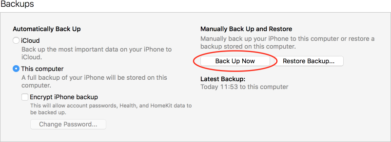
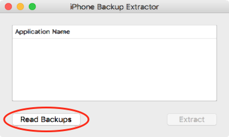
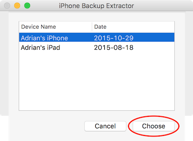

+++
title = "How to Extract Data from iOS Apps on MacOS"

[taxonomies]
tags = ["iOS", "macOS"]
+++

I've been using the sleep tracking app [SleepBot](https://mysleepbot.com)
for more than 2 years.
It was a great app and it had always served me well.
Recently, however, I noticed that the app isn't maintained anymore.
This means it's just a question of time until the app stops working.
In order to be safe I started to use my calendar
to track my sleep behavior.
(It also seems to make more sense to bundle all "event-data" in one spot,
instead of scattering it over several apps.)

And while I'm happy with my new setup,
there is one problem:
The old data is still in the SleepBot app.
To make things worse,
I couldn't find any way to export the data from the app.
There was no export button, no send per email, nor any other way.
And although there is a webapp to access a sleeping dashboard,
it only seems to sync with the Android app. Great!

**So how can I access the data? It still has to be somewhere, right?**

The solution is the great tool "iPhone Backup Extractor".
It extracts app data from iPhone/iPad backups which were created with iTunes.
You can either install it from the [website](http://supercrazyawesome.com)
or with [Hombebrew Cask](http://caskroom.io/) via your terminal: 
`brew cask install iphone-backup-extractor`.

To get started, you first of all need to create a backup of your iOS device.

1. Connect the device to your Mac.
1. Open iTunes.
1. Click the iPhone/iPad icon to access the settings menu.

  

1. Create a backup of your device by clicking the "Back Up Now" button.
  **Make sure that the "Encrypt iPhone backup" option is NOT set.**
  Otherwise iPhone Backup Extractor won't be able to access the backup.

  

Now you can use the iPhone Backup Extractor
to extract the data of a particular app from the backup.

1. Open the iPhone Backup Extractor.
1. Click "Read Backups" to find suitable backups.

  

1. Select the proper backup and click "Choose" to confirm.

  

1. Select the app you want to extract the data from
  and click "Extract" to confirm.

  

1. Finally select a directory to save the data to
  and click "Extract here" to finish the process.

In the created directory you can find the main data in
the `Documents` directory and in the file 
`Library/Application Support/<app-name>/<app-name>.sqlite`. 
This is a SQLite database-file and contains your app's data in several tables.

The last step is now to export the tables to a format
which can be easily read and manipulated
with programs like Excel and Libre Office.
I used the "DB Browser for SQLite", which is a simple tool to
"create, design and edit database files compatible with SQLite."
Again you can install it from the [website](http://sqlitebrowser.org/)
or with Hombebrew Cask: `brew cask install sqlitebrowser`.

1. Open the `.sqlite` file with the SQLite Browser
1. Right click the table you want to export in the "Tables" section
1. In the popup menu click "Export as CSV file"
1. Confirm the default settings by clicking "OK"
1. Select a destination and confirm with "Save"

And there we go. 🎉
You now have a `.csv` file which you can easily import into
the spreadsheet processor of your choice or even view and edit
with a normal text-editor.
