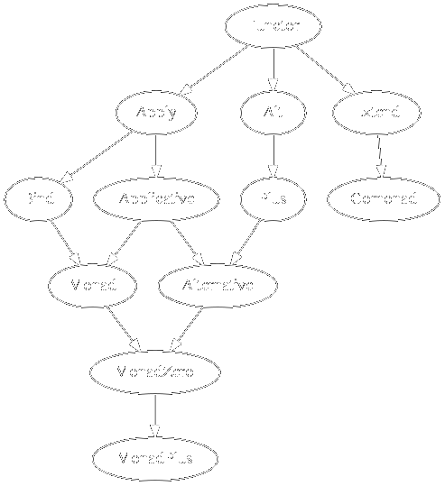

+++
title = "Introduction to PureScript for Haskell Developers"
author = "Adrian Sieber (ad-si.com)"
date = 2019-08-15
theme = "default"
colortheme = "owl"
innertheme = "circles"
aspectratio = 169
image = "./expanding_brain.jpg"
draft = true

[taxonomies]
tags = ["PureScript", "Haskell"]
+++


## Why PureScript Instead of JavaScript

::: notes

For this post I'm going to try a new hybrid slides + text format.
I attached an explanation at the bottom on how to build it

:::

- Safety
  - No more `undefined is not a function`
  - No more `0 == false`
  - No more mutation
    ```js
    const people = [{name: 'John'}, {name: 'Anna'}]
    const newPeople = people.map(x => {
      x.color = 'green'
      return x
    })
    ```
- More robust
- Better maintainability and refactoring


## Example

Write a function which creates a CSS RGB string:

&nbsp;

```javascript
function getRgbColor (red, green, blue) {
  return `rgb(${red},${green},${blue})`
}
```
&nbsp;

Well ... this shouldn't be possible:

```javascript
console.log(getRgbColor(undefined, 234, null))
```

---

Let's fix it:

```javascript
function getRgbColor (red, green, blue) {
  if (red && green && blue) {
    return `rgb(${red},${green},${blue})`
  }
  else throw new Error('Please provide a valid color')
}
```
&nbsp;

But wait a minute:
&nbsp;

```javascript
console.log(getRgbColor(221, 175, 15))
// rgb(221,175,15)

console.log(getRgbColor(221, 0, 89))
// Error: Please provide a valid color
```

---

Solution:

&nbsp;

```javascript
function getColor (red, green, blue) {
  const isValidColor =
    isFinite(red) &&
    isFinite(green) &&
    isFinite(blue)

  // TODO: Check for upper and lower bound

  if (isValidColor) return `rgb(${red},${green},${blue})`
  else throw new Error('Please provide a valid color')
}
```

---

**NOT THE GLOBAL `isFinite`**

&nbsp;

```javascript
isFinite(null) === true
Number.isFinite(null) === false
```

---

\center \Huge JavaScript is a Minefield!

---

\begin{table}
\begin{tabular}{cc}
\textbf{ES3}
  & \raisebox{-.5\height}{\includegraphics[width=30mm]{./expanding_brain/0.jpg}} \\
\textbf{ES2015}
  & \raisebox{-.5\height}{\includegraphics[width=30mm]{./expanding_brain/1.jpg}} \\
\textbf{TypeScript}
  & \raisebox{-.5\height}{\includegraphics[width=30mm]{./expanding_brain/2.jpg}} \\
\textbf{PureScript}
  & \raisebox{-.5\height}{\includegraphics[width=30mm]{./expanding_brain/3.jpg}} \\
\end{tabular}
\end{table}


<!--
## Infos

- Invented by Phil Freeman
- Compiles to ES3
-->


## Compilation Example 1: Curried Functions

PureScript
:   ```purescript
    add3 :: Int -> Int -> Int -> Int
    add3 valA valB valC =
      valA + valB + valC
    ```

&nbsp;

JavaScript
:   ```javascript
    var add3 = function (valA) {
        return function (valB) {
            return function (valC) {
                return (valA + valB | 0) + valC | 0;
            };
        };
    };
    ```


## Compilation Example 2: Foreign Function Interface

JavaScript
:   ```javascript
    exports.calculateInterest = amount => {
      return amount * 0.1
    }
    ```

&nbsp;

PureScript
:   ```purescript
    module Interest where

    foreign import calculateInterest :: Number -> Number
    ```

## Main Differences

- Prelude
  - Must be included explicitly
  - Smaller
  - No libraries are distributed with the compiler
- Strict, and not Lazy
- `head`, `tail`, … safe per default
- More explicit:
  - "X has unspecified imports, consider using the explicit form"
  - Type-classes must explicitly be imported with the `class` keyword
    ```purescript
    import A (class B)
    ```
- Applicative Do with `ado` keyword
- `|` (pipe character) must appear on every line in documentation comments


## Class and Type Differences

- Type variables must be declared
  ```purescript
  length :: forall a. Array a -> Int
  ```
- Instance chains (type-class programming without overlapping instances)
  ```purescript
  instance zeroSucc :: Succ "zero" "one"
  else instance oneSucc :: Succ "one" "two"
  …
  ```
- Class constraint arrow is flipped
  ```purescript
  class (Eq a) <= Ord a where …
  ```
  where `<=` means "logical implication"
- No default member implementations for type classes (yet)


## Missing Features

- Lists only via external library
  (`[]` and `(:)` for Arrays, `List` and `Cons` for Lists)
- No built in tuples (but external Tuple library with `Tuple a b`)
- No `qualified` keyword as `import` is qualified per default
- No Template PureScript (yet)
- Orphan instances are completely disallowed


## Deriving

Basically as if `StandaloneDeriving` was enabled in GHC.

&nbsp;

Haskell:
:   ```haskell
    data Point = Point Int Int deriving (Eq, Ord)
    ```

&nbsp;

PureScript:
:   ```purescript
    data Point = Point Int Int

    derive instance eqPoint :: Eq Foo
    derive instance ordPoint :: Ord Foo
    ```

## Instance Names

Instances must be given names:

&nbsp;

```purescript
instance arbitraryUnit :: Arbitrary Unit where …`
```

&nbsp;

- Increase readability of compiled JavaScript
- Deterministic names are good,
  but no good function which still produces nice names
- Renaming a class or type can break FFI code
- Name instances differently:
  `instance refl :: TypeEquals a a`


## Defining Operators

Only available as operator alias for named functions:

&nbsp;

Haskell:
:   ```haskell
    f $ x = f x
    ```

&nbsp;

PureScript:
:   ```purescript
    apply f x = f x
    infixr 0 apply as $
    ```

## Operator Sections

Sections of an infix operator are only available with wildcards:

&nbsp;

Haskell:
:   ```haskell
    (2 /)
    (/ 2)
    ```

&nbsp;

PureScript:
:   ```purescript
    (2 / _)
    (_ / 2)
    ```


## Multiline Strings

Additional support for `"""` multiline strings:

&nbsp;

Haskell and PureScript:
: &nbsp;

&nbsp;
:   ```haskell
    sentence = "\
      \This is\n\
      \just some text\n\
      \split over several lines\n"
    ```

&nbsp;

PureScript:
:   ```purescript
    sentence = """This is
    just some text
    split over several lines
    """
    ```


## Names

:::::::::::::: {.columns}
::: {.column width="40%"}

**Haskell**    | **PureScript**
---------------|----------------
`IO`           | `Effect`
`data () = ()` | `data Unit = unit`
`&`            | `#`
`Bool`         | `Boolean`
`..`           | `range`
`++`           | `<>`
`fmap`         | `map`
`Text`         | `String`

:::
::: {.column width="60%"}

**Haskell**         | **PureScript**
--------------------|----------------
`.`                 | `<<<`
`>>>`               | `>>>`
`[a]`               | `Array a` / `List a`
`(a, b)`            | `Tuple a b`
`return`            | `pure`
`[x^2 | x<-[1..5]]` | `list` monad + `guard`
`undefined`         | `unsafeCoerce`
`>>`                | `*>`

:::
::::::::::::::

&nbsp;

But as nothing is included per default, you can change everything!


## Records

```purescript
module Main where
import Effect.Console (log)

book =
  { title: "Eine Woche voller Samstage"
  , author: "Paul Maar"
  , year: 1973
  }

main = log book.title
```

&nbsp;

compiles to …

---

```javascript
// Generated by purs version 0.12.0
"use strict";
var Effect_Console = require("../Effect.Console/index.js");
var book = {
    title: "Eine Woche voller Samstage",
    author: "Paul Maar",
    year: 1973
};
var main = Effect_Console.log(book.title);
module.exports = {
    book: book,
    main: main
};

```

&nbsp;

*Side note*:
The syntax for fields is the reason why `.` isn't used for function composition


## Field Access Function

```purescript
main = do
  log $ _.title {title: "Just a title"}
  log $ _.title book
```


## Updating a Record

```purescript
nextBook = book {title = "Am Samstag kam das Sams zurück"}
```

&nbsp;

*Side note*:
This would be ambiguous if Records used `=` instead of `:` for assignments.

Does it mean "apply function `book` to object `{ title: "…" }`"
or "update the `title` of `book`"?


## Pattern Matching on Records

```purescript
paulsTitle {author: "Paul Maar", title: t} = Just t
paulsTitle _ = Nothing
```


## Record Types

Haskell:
:   ```haskell
    data Book = Book
      { title :: Text
      , author :: Text
      , year :: Int
      }
    ```

&nbsp;

PureScript:
:   ```purescript
    type Book =
      { title :: String
      , author :: String
      , year :: Int
      }
    ```


## Row Polymorphism

```purescript
showPrint :: forall a.
  { title :: String, author :: String | a }
  -> String
showPrint b =
  b.title <> " by " <> b.author

main :: Effect Unit
main = do
  log $ showPrint book
```

&nbsp;

The kind of `a` is `# Type` (A row of types)

---

```purescript
> :kind { title :: String }
Type
> :kind ( title :: String )
# Type
> :kind Record
# Type -> Type
> :kind Record ( title :: String )
Type
```

&nbsp;

- A row of types is a type level description of pairs of labels and types
- `{ title :: String }` is just syntax sugar for `Record ( title :: String )`

&nbsp;

```purescript
type EitherTitleOrYear = Variant ( title :: String, year :: Int )
```

<!--
## Type Class Hierarchy

:::::::::::::: {.columns}
::: {.column width="60%"}


From: https://wiki.haskell.org/Typeclassopedia
Comparison: http://techscursion.com/2017/02/typeclass-cheatsheet.html

:::
::: {.column width="40%"}



From: https://pursuit.purescript.org/packages/purescript-control/4.1.0

:::
::::::::::::::
 -->

## Type Class Hierarchy

Finer subdivision into more classes:

&nbsp;

- `Category` has a superclass `Semigroupoid`
  (provides `<<<`, does not require an identity)

- `Monoid` has a superclass `Semigroup`
  (provides `<>`, does not require an identity)

- `Applicative` has a superclass `Apply`
  (provides `<*>`, does not require an implementation for `pure`)


## Active Extensions

Equivalent to enabling following extension in GHC

- `DataKinds`
- `EmptyDataDecls`
- `ExplicitForAll`
- `FlexibleContexts`
- `FlexibleInstances`
- `FunctionalDependencies`
- `KindSignatures`
- `MultiParamTypeClasses`
- `PartialTypeSignatures`
- `RankNTypes`
- `RebindableSyntax`
- `ScopedTypeVariables`
- `UndecidableInstances` (cuts off after to much looping)


## Low Level Adaptions for JavaScript

Several design decisions were made to improve the generated JavaScript:

&nbsp;

- Direct mapping to JavaScript:
  ```purescript
  Boolean = true | false
  ```
- Arrays instead of lists
- Named instances
- Records → JavaScript Objects
- `String` is a JavaScript String (and not `[Char]`)


## Tooling

Haskell                | PureScript
-----------------------|--------------------------------------
`ghc`                  | `purs`
`ghci`                 | `purs repl`
`ghcid`                | `pscid`
`stack`                | `pulp`
`stack init`           | `pulp init`
`stack exec`           | `pulp run`
[haskell.org]          | [purescript.org]
[hackage.haskell.org]  | [bower.io] \(or psc-package via git)
[hoogle.haskell.org]   | [pursuit.purescript.org]
[try.haskell.org]      | [try.purescript.org] \(not up to date yet)

[bower.io]: https://bower.io
[hackage.haskell.org]: https://hackage.haskell.org
[haskell.org]: https://haskell.org
[hoogle.haskell.org]: https://hoogle.haskell.org
[purescript.org]: http://purescript.org
[pursuit.purescript.org]: http://pursuit.purescript.org
[try.haskell.org]: https://try.haskell.org)
[try.purescript.org]: http://try.purescript.org


## Use Cases and Notable Projects 1

- Frontend
  - Halogen - UI library
  - Pux - Web apps like Elm

- Reactive Tools / Websites
  - Flare - Reactive UI
  - [PureScript Pop] - FRP demo
  <!-- https://www.youtube.com/watch?v=iTSosG7vUyI&t=16s -->

- JavaScript Plugins

- Cloud functions


## Use Cases and Notable Projects 2

- CLI tools (can also be executed in the browser!)
  - Insect - CLI calculator
  - Transity - Plaintext accounting tool
  - Neodoc - CLI args parser

- Game Development
  - [PureScript is Magic](https://bodil.lol/purescript-is-magic/)

- Interfaces, bindings, and wrappers for JavaScript libraries
  - D3
  - React

- Language experiments
  - [Neon] - Alternative Prelude without type class hierarchy

[PureScript Pop]: https://github.com/lettier/purescript-pop
[Neon]: https://github.com/tfausak/purescript-neon


## The Not so Good

- Trying to remember the differences to Haskell

- Smaller Ecosystem than Haskell

- New compiler versions break a lot

- Performance

- Memory footprint of Node.js


<!--
## Getting Started

[javascript-to-purescript]

[javascript-to-purescript]: https://github.com/adkelley/javascript-to-purescript

## PureScript of Elm
-->

## Future Development

PureScript
:   - More backends:
      - pure-c - C backend for PureScript
      - pureswift - Swift backend for PureScript
    - Stable compiler

Haskell
:   - Backport features
      (most PureScript developers are also Haskell developers)
    - Maybe it catches up
      - Compile to Webassembly
      - Fix Records


## Summary

\center \Huge PureScript is currently the best way to write JavaScript!


<!--
## TODO

- https://youtu.be/5AtyWgQ3vv0 - PureScript: Tomorrow’s JavaScript Today
-->
