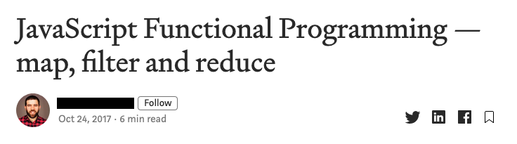
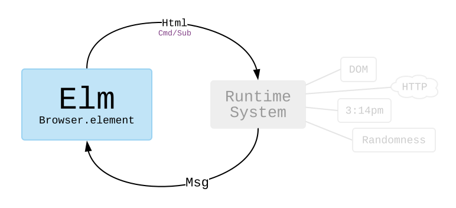

+++
title = "Purely Functional Programming - More than just a flavor of FP"
author = "Adrian Sieber | CTO at qthority.com | 10 years of JavaScript experience"
date = 2019-11-27
theme = "default"
colortheme = "owl"
innertheme = "circles"
aspectratio = 169
image = "./expanding_brain.jpg"
draft = true

[taxonomies]
tags = ["PureScript", "JavaScript", "pure"]
+++

## TODO

### --------

Move functions out of `main`


### --------

From the React documentation (https://reactjs.org/docs/hooks-reference.html)

> Mutations, subscriptions, timers, logging, and other side effects
> are not allowed inside the main body of a function component
> (referred to as React’s render phase).
> **Doing so** will lead to confusing bugs and inconsistencies in the UI.

It's still possible!


## What Is Functional Programming?

\center \Huge
> Functional Programming treats computation
> as the evaluation of mathematical functions
> and avoids changing-state and mutable data.

\small From Wikipedia


## Advantages?

\center \Huge
> Eliminating side effects
> (changes in state that do not depend on the function inputs)
> can make understanding a program easier.

\small From Wikipedia


## What About JavaScript?

\center \Huge
> As a multi-paradigm language, JavaScript supports event-driven,
> functional, and imperative
> (including object-oriented and prototype-based)
> programming styles.

\small From Wikipedia


## How Do We Use It?



Well, that should be easy, right?


## Example

&nbsp;

```js
const people = [{name: 'John'}, {name: 'Anna'}]
const newPeople = people.map(x => {
  x.color = 'green'
  return x
})
```

&nbsp;

*What's wrong with this code?*


## Unexpectedly, the Arrays Look the Same ¯\\_(o,o)_/¯

```js
>> people
0: Object { name: "John", color: "green" }
1: Object { name: "Anna", color: "green" }

>> newPeople
0: Object { name: "John", color: "green" }
1: Object { name: "Anna", color: "green" }
```

Somehow we mutated the `people` array …


## What We Actually Wanted

```js
const people = [{name: 'John'}, {name: 'Anna'}]
const newPeople = people.map(x => {
  const temp = Object.assign({}, x)
  temp.color = 'green'
  return temp
})
```


## So What's the Root Cause?

\center \Huge
… JavaScript *supports*\* functional …

&nbsp;

&nbsp;

\normalsize \* But you can still easily shoot yourself in the foot …


## Another Example

```js
const title = 'functional programming is awesome'
const emphasizedTitle = exclaim(title)

console.log(emphasizedTitle)

// FUNCTIONAL PROGRAMMING IS AWESOME!!!
```

## Yay, Functional! Right?

\Large

- Immutable => Returns a new string and old one isn't changed
- Pure function => Output only depends on input
- No side effects

*… or are there?*


## WELP!!!

\large

```js
function exclaim (string) {
  Rocket.launch({target: gpsModule.getCurrentLocation()})
  globalState.nukeWasLaunched = true
  console.log('We just nuked you. Bye, bye sauerkrautfresser!')
  return string.toUpperCase() + '!!!'
}
```

Oh well, look at those unfortunate side effects:

- Depends on location
- Modifies global state
- Logs to standard out
- Does something completely unexpected in the background


## Then Let's Just Use One of the Functional Libraries?

\Large

> Immutability works best when it is pervasive.
> But the JavaScript language and ecosystem is designed around mutable data,
> you can’t enforce immutability from a library, …

\small reaktor.com/blog/fear-trust-and-javascript

---

\begin{table}
\begin{tabular}{cc}
\textbf{Functional Concepts}
  & \raisebox{-.5\height}{\includegraphics[width=30mm]{./expanding_brain/0.jpg}} \\
\textbf{Typed + Functional Concepts}
  & \raisebox{-.5\height}{\includegraphics[width=30mm]{./expanding_brain/1.jpg}} \\
\textbf{Typed + Functional Architecture}
  & \raisebox{-.5\height}{\includegraphics[width=30mm]{./expanding_brain/2.jpg}} \\
\textbf{Purely Functional}
  & \raisebox{-.5\height}{\includegraphics[width=30mm]{./expanding_brain/3.jpg}} \\
\end{tabular}
\end{table}

---

## Purely Functional Programming (e.g. Elm)

\Large

- Everything -- **no exception** -- is written in a functional style
- Everything -- **no exception** -- is immutable
- Everything -- **no exception** -- is strongly typed \*
- Compiles to JavaScript

&nbsp;

\normalsize

\* While not strictly part of the definiton,
there are no commonly used untyped pure FP languages


## Safety++++++++

\Large

You can't shoot yourself in the foot. \newline
Even if you try really hard. \newline
The compiler just won't let you!


## Example

```elm
import String exposing (toUpper)

exclaim : String -> String
exclaim string =
  (toUpper string) ++ "!!!"
```

&nbsp;

**You can run it on ellie-app.com**


## Launch a Rocket, Maybe?

```elm
exclaim : String -> String
exclaim string =
  (toUpper string) ++ "!!!"
```

- What would `launch rocket` return?
- Only `main` function is allowed to have side effects
- How would you execute several statements
  if everything is an expression?

&nbsp;

**There is no way to write that code!**


## So How Do You Launch a Rocket?



---

```elm
type Msg = LaunchRocket
         | LaunchInitiated (Result Http.Error String)

type Model = Waiting
           | Launching
           | LaunchSuccess String
           | LaunchFailure String

update : Msg -> Model -> (Model, Cmd Msg)
…

view : Model -> Html Msg
…
```

&nbsp;

**Side effects are already visible in the type signature!**


## All Purely Functional Languages

\Large

- **Elm** - No bullshit HTML UIs and apps
- **PureScript** - Full power of JavaScript
  - Compiles to *readable* JavaScript
  - Advanced FP features
- **Haskell** - Mother of all Purely FP languages
  - Compiles to binaries
  - C like performance


## Not Completely Functional

\Large

- **Rust**
  - Unpure functions
  - No tail-call optimization for recursion
  - https://www.fpcomplete.com/blog/2018/10/is-rust-functional
- **Swift** - Also Object oriented, unpure, mutating, …
- **Scala** - Also Object oriented
- **Clojure** - Also Object oriented

&nbsp;

**You can use them in a more or less functional way,
but it depends on your discipline and skills.**


## Summary of Advantages

\Large

- You can finally sleep in peace
- When it compiles it runs
- Parallelization at the flip of a switch
- Testing is straight forward
- Onboarding is a breeze
- Maintainability is through the roof


## Thank You For Your Attention!

\Huge Any questions?

&nbsp;

\Large PS: We are looking for working students! \newline
\Large PS2: More rants on Twitter @AdrianSieber
