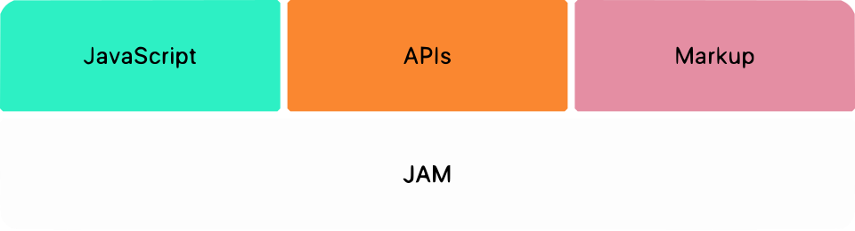

+++
title = "Elm Pages - A statically typed site generator"
author = "Adrian Sieber (ad-si.com)"
date = 2020-02-06
theme = "default"
colortheme = "owl"
innertheme = "circles"
aspectratio = "169"
draft = true
+++


## The New Gold Standard for Websites: JAMstack



&nbsp;

> JAMstack - A modern web development architecture
> based on client-side JavaScript, reusable APIs,
> and prebuilt Markup

\footnotesize Mathias Biilmann (CEO & Co-founder of Netlify)

---

**JavaScript**

- Dynamic functionalities are handled by JavaScript
- No restriction on which framework or library to use

**APIs**

- Server side operations are abstracted into reusable APIs
    and accessed over HTTPS with JavaScript
- Tird party services or custom functions


**Markup**

- Websites are served as static HTML files
- Generated from source files, such as Markdown,
    using a Static Site Generator


## But Also:


**Progressive Web Apps**

- Only load the critical HTML, CSS, data, and JavaScript
    through code & data splitting
- Once loaded, prefetch resources for other pages
- Offline access


**CSS in JS**

- Complete isolation for selectors, animations, keyframes
- Backwards compatibility
- Dynamic styles and themes support


## So What Exactly Does It Add to an Elm App?

- **Accessibility** - Screen readers, low performance systems, …
- **SEO** - Make website visible for bots which don't execute JavaScript
- **Performance** - Serve pre-built markup and assets over a CDN
- **Compile Time Code Execution**
    - **Requests** - Load data which is not accessible on the frontend
    - **Page Generation** - Don't let the frontend waste its time


## And what does Elm add to the JAMstack concept?

- Type-safety and simplicity
- Type system guarantees valid images and routes in the right places
- Build errors for broken links or images in markdown (optional)
- Custom rules like maximum title length,
    tag names from a set to avoid multiple tags with different wording, …


---

\Huge `elm-pages` is just Elm!


\Large elm-pages hydrates into a full-fledged Elm app


## Example Page

\Huge [elm-pages.com](https://elm-pages.com)


## Directory Structure

```elm
.
|-- content/
|   |-- index.md
|-- src/
|   |-- Main.elm
|-- package.json
|-- elm.json
`-- index.js
```


## Folders

\huge

`content`
: Each file in the content folder result in a new route of your site.

&nbsp;

`src`
: No strict requirements except for the main function


## Entrypoint `index.js`

```js
import hljs from 'highlight.js/lib/highlight'
import 'highlight.js/styles/github.css'
import elm from 'highlight.js/lib/languages/elm'
hljs.registerLanguage('elm', elm)

import './style.css'

window.hljs = hljs
const { Elm } = require('./src/Main.elm')
const pagesInit = require('elm-pages')

pagesInit({
  mainElmModule: Elm.Main,
})
```


## `Main.elm`

```elm
main : Pages.Platform.Program Model Msg Metadata Rendered
main =
    Pages.Platform.application
        { init = \_ -> init
        , view = view
        , update = update  -- Msg -> Model -> ( Model, Cmd Msg )
        , subscriptions = subscriptions  -- Model -> Sub Msg
        , documents = [ markdownDocument ]
        , manifest = manifest
        , canonicalSiteUrl = "https://elm-pages.com"
        , onPageChange = \_ -> ()
        , generateFiles = generateFiles
        , internals = Pages.internals
        }
```


## `view`

```elm
List ( PagePath Pages.PathKey, Metadata )
    ->
        { path : PagePath Pages.PathKey
        , frontmatter : Metadata
        }
    ->
        StaticHttp.Request
            { view : Model -> Rendered -> { title : String, body : Html Msg }
            , head : List (Head.Tag Pages.PathKey)
            }
```


## `elm-pages` Generates Elm Code in `/gen/Pages.elm`

```elm
allPages : List (PagePath PathKey)
allPages =
    [ (buildPage [ "blog", "draft" ])
    , (buildPage [ "blog", "hello" ])
    , (buildPage [ "blog" ])
    , (buildPage [ "elm-meetup" ])
    , (buildPage [  ])
    ]

content : List
  ( List String
  , { extension: String, frontMatter: String, body: Maybe String }
  )
content = …
```


## Other Data is Added Manually

`src/Data/Author.elm`

```elm
type alias Author =
    { name : String
    , avatar : ImagePath Pages.PathKey
    , bio : String
    }

all : List Author
all =
    [ { name = "Dillon Kearns"
      , avatar = Pages.images.author.dillon
      , bio = "Elm developer and educator."
      }
    ]
```


## Metadata

```elm
type Metadata
    = Page PageMetadata
    | Article ArticleMetadata
    | Author Data.Author.Author
    | BlogIndex
```

---

\Huge Thank you for your attention!


<!--
## Steps


```sh
mkdir elm-pages-test

cd elm-pages-test

elm init

touch src/Main.elm

mkdir content

edit content/welcome_to_elm_frankfurt.md

npm install --save-dev elm elm-pages

npx elm install \
  avh4/elm-color \
  dillonkearns/elm-pages \
  dillonkearns/elm-rss \
  dillonkearns/elm-sitemap \
  elm/json \
  elm/time \
  elm/url

npx elm-pages build
```
 -->
