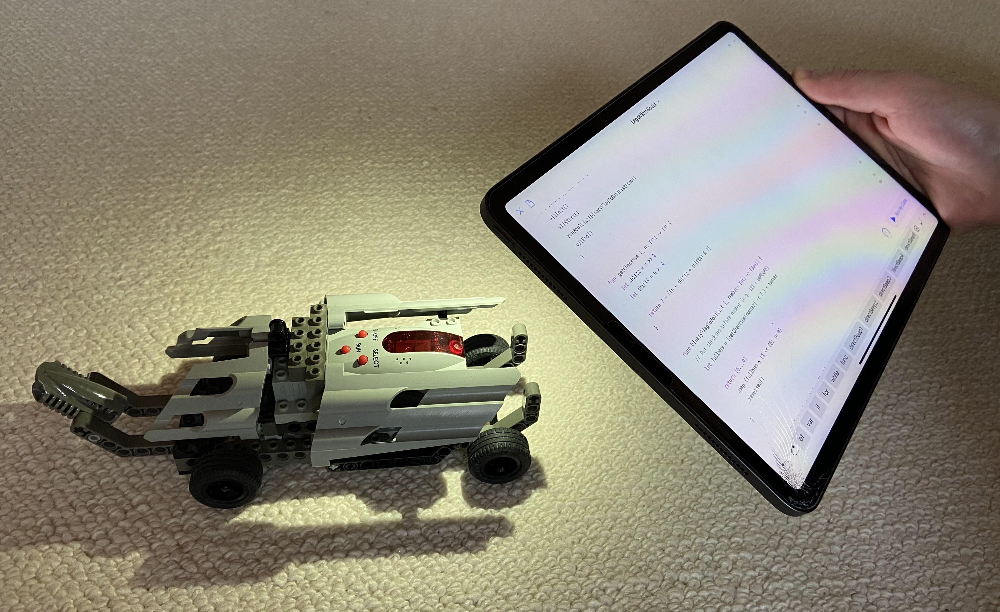
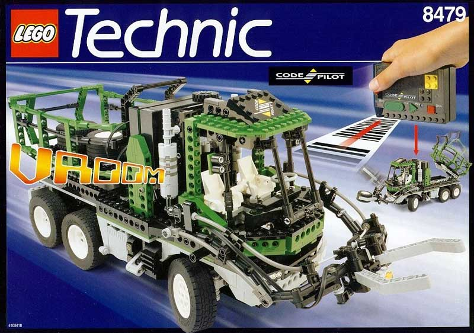
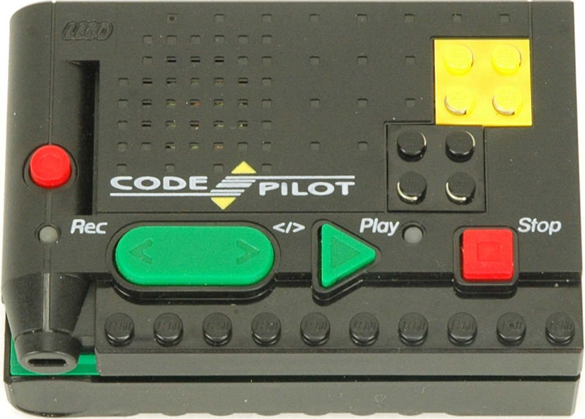
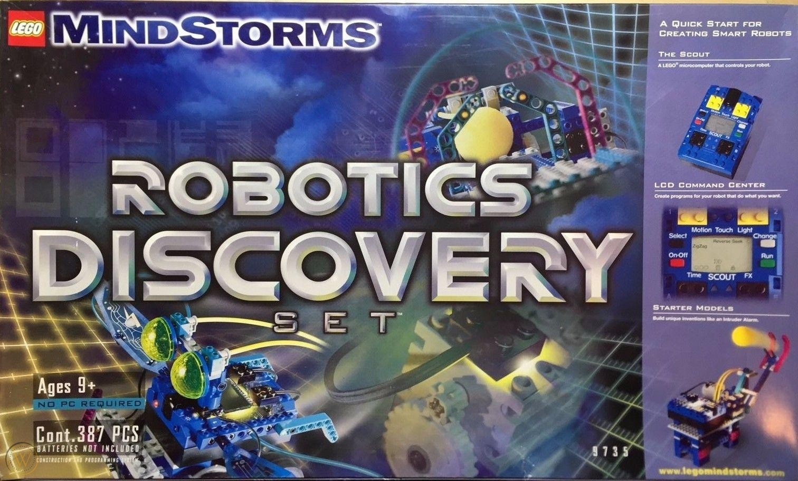
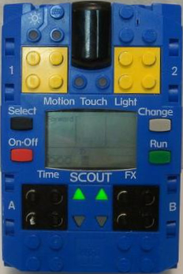
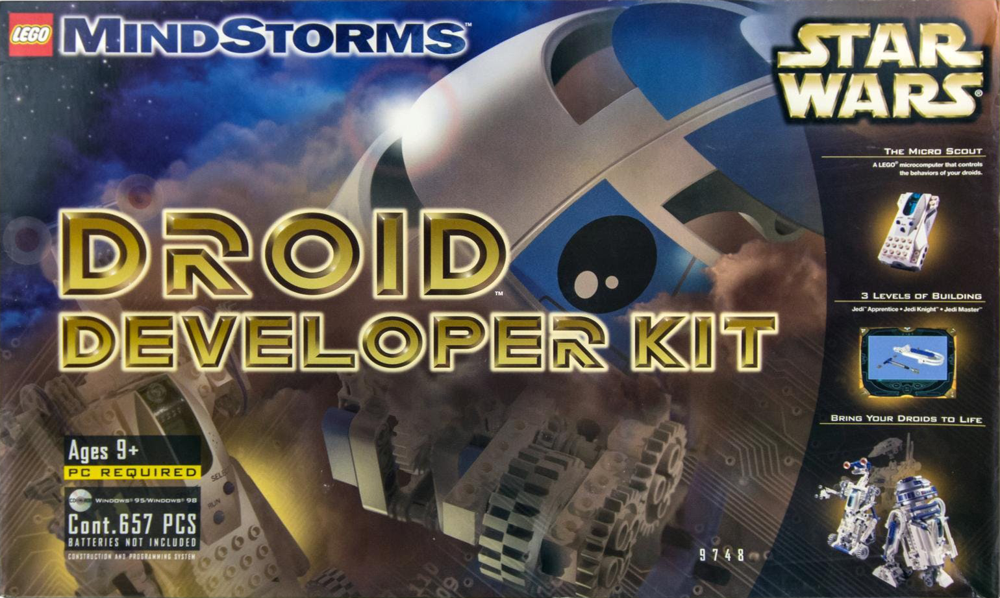
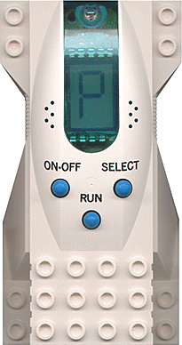
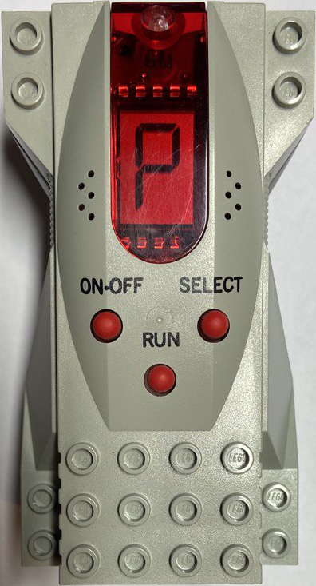

+++
title = """
  Control a LEGO Code Pilot, Scout, or MicroScout
  via Swift Playgrounds on iPadOS
"""
draft = true

[taxonomies]
tags = ["LEGO", "iPadOS", "Swift", "Swift Playgrounds"]
+++

<style>
  table {
    font-size: 0.8em;
  }
  table td, table th {
    padding: 0.5em;
  }
  td a {
    display: inline-block;
    margin-bottom: 0.5em;
  }
  td img {
    max-height: 14em;
  }
</style>



&nbsp;

More than 20 years ago LEGO released 4 quite interesting LEGO Technic sets:


Year| Set                                              | Controller
----|------------------------------------------------------------|:-----------:
1997|[LEGO Technic Code Pilot][code-pilot]|Code Pilot 
1999|[Robotics Discovery Set][discovery-set] |Scout 
1999|[Droid Developer Kit][droid-kit] |Micro Scout (bright) 
2000|[Dark Side Developer Kit][dark-kit] |Micro Scout (dark) 

[code-pilot]: https://brickipedia.fandom.com/wiki/8479_Barcode_Multi-Set
[discovery-set]: https://brickipedia.fandom.com/wiki/9735_Robotics_Discovery_Set
[dark-kit]: https://brickipedia.fandom.com/wiki/9754_Dark_Side_Developer_Kit
[droid-kit]: https://brickipedia.fandom.com/wiki/9748_Droid_Developer_Kit

Each set contains a programmable micro controller and while they seem
to be from different LEGO lineages, they actually share the same code base.
They were the smaller siblings of the full fledged yellow
LEGO Mindstorms RCX controller featured in the
[Robotics Invention System][invention_set].

[invention_set]:
    https://brickipedia.fandom.com/wiki/9719_Robotics_Invention_System

Although there were a whole lot of programming languages
and development kits available for the RCX,
the options for our 4 sets were more reduced.
The Scout at least supported LEGO Assembly (LASM)
– as described in the [Scout SDK] –
but the others only could be programmed with VLL (Visual Light Link).

<small>There is actually one more robotic system which was programmed via VLL
– [LEGO Spybotics](https://brickipedia.fandom.com/wiki/Spybotics) –
but VLL was merely used as an abstract transmission protocol for it.
</small>

VLL is comprised of short light pulses (20 ms - 400 ms) which
amount to 35 bit binary codes.
Each code triggers one action of the micro controller.

For a detailed description of the format check out [elecbrick.com/vll/]
and for a listing of all the possible codes of the different controllers
check out the last 2 pages of the [Scout SDK].

In order to transmit the codes to the controllers, there are 2 different ways:


**1. Barcodes**

In case of the code pilot this was achieved with a set of barcodes
which could be slid past the light sensor to
generate the necessary light pulses.

The LEGO set included a printed manual with all the codes
and in order to transmit them to the controller,
you simply swept the controller's photo-diode past the barcode.


  Activation of preprogrammed script
  to back up the rover if the way is blocked.



**2. Direct Light Flashes**

The more straight forward approach is to directly
flash the light patterns at their light sensors.
The LEGO RCX micro controller actually was natively able to produce VLL to
control its 4 siblings.


  LEGO RCX connected to a Micro Scout via an optical fiber.
  Photo by
  <a href="http://waterpigs.co.uk/articles/rcx-vll/">Barnaby Walters</a>.


But since the patterns are quite simple,
ultimately every programmable light source can be used to
control the Micro Scout.

E.g.
[here](https://learn.adafruit.com/bluetooth-remote-for-lego-droid)
is a tutorial on how to program a Feather M0 Bluefruit LE board
with CircuitPython to breath new life into a LEGO R2-D2.


  Feather M0 Bluefruit LE board controlling a Micro Scout
  via an LED.
  Photo by <a href="https://learn.adafruit.com">Adafruit</a>.


And this is were it gets really interesting:
Since an iPad has an LED (the camera flash),
a quite capable development environment ([Swift Playgrounds]),
and supports one of the best programming languages around ([Swift]),
it's easily one of the most approachable,
yet also most powerful ways to program via VLL.

[Swift Playgrounds]: https://www.apple.com/swift/playgrounds/
[Swift]: https://swift.org/

To get started we first need to write the necessary code to transmit the VLL commands.
I will focus on the Micro Scout instruction set,
but the code could be easily extended to also support the other controllers.

Create a new Playground in Swift Playgrounds and paste the following code,
or download the
[full Playground with additional features](LegoMicroScout.playground.zip).


```swift
import AVFoundation  // Necessary for activating the flash

/* Binary codes as described in the Scout SDK.
Distinguishes between direct commands, which are executed immediately
and scripting commands, which are only executed once the run command
is triggered. */

let directSpinCw05s  = 0b0000000  //  0 - Spin motor 0.5 seconds clockwise
let directSpinAcw05s = 0b0000001  //  1 - Spin motor 0.5 seconds anticlockwise

let directBeep1      = 0b0000100  //  4
let directBeep2      = 0b0000101  //  5
let directBeep3      = 0b0000110  //  6
let directBeep4      = 0b0000111  //  7
let directBeep5      = 0b0001000  //  8

let directStop       = 0b0001111  // 10

// All motor scripting commands play a short jingle before activation
// This can unfortunately not be prevented
let scriptCw05s      = 0b0010000  // 16 - Spin motor 0.5 seconds clockwise
let scriptCw1s       = 0b0010001  // 17 -      "     1               "
let scriptCw2s       = 0b0010010  // 18 -      "     2               "
let scriptCw5s       = 0b0010011  // 19 -      "     5               "

let scriptAcw05s     = 0b0010100  // 20 - Spin motor 0.5 seconds anticlockwise
let scriptAcw1s      = 0b0010101  // 21 -      "     1               "
let scriptAcw2s      = 0b0010110  // 22 -      "     2               "
let scriptAcw5s      = 0b0010111  // 23 -      "     5               "

let scriptBeep1      = 0b0011000  // 24
let scriptBeep2      = 0b0011001  // 25
let scriptBeep3      = 0b0011010  // 26
let scriptBeep4      = 0b0011011  // 27
let scriptBeep5      = 0b0011100  // 28

// Pause run until light is shined on sensor
let scriptWaitLight  = 0b0011101  // 29

// Spin clockwise in bursts until light is shined on sensor
// then spin anticlockwise until light is out of range
// Continues with script after 30 seconds of spinning clockwise.
let scriptSeekLight  = 0b0011110  // 30

// Beeps a pattern and waits for someone flashing that same pattern back.
// If correct or after 3 failed attempts, it continues with the program.
let scriptCode       = 0b0011111  // 31

// Stays still in dark, shortly spins clockwise if light is flashed.
// Continues with script after 30 seconds of standing still.
// Makes continuous clockwise spinning possible by regularly flashing.
let scriptKeepAlive  = 0b0100000  // 32

let directRun        = 0b0100001  // 33 - Same as pressing the run button
let directDelete     = 0b0100010  // 34 - Delete all previously stored commands

// Not sure what those commands are for. Let me know if you have any insights!
let scriptNext       = 0b1000110  // 70
let scriptReset      = 0b1000111  // 71

// Maximum number of commands which can be stored before execution.
// Plays a deep beep when storage is full.
let maxNumCmds = 15

func sleepMs (_ milliseconds: Int) {
  usleep(useconds_t(milliseconds * 1000))
}

func torchOn() {
  guard let device = AVCaptureDevice.default(for: AVMediaType.video)
    else { return }
  guard device.hasTorch else { return }

  do {
    try device.lockForConfiguration()
    try device.setTorchModeOn(level: 1.0)
  }
  catch { print(error) }

  device.unlockForConfiguration()
}

func torchOff() {
  guard let device = AVCaptureDevice.default(for: AVMediaType.video)
    else { return }
  guard device.hasTorch else { return }

  do {
    try device.lockForConfiguration()
  }
  catch {
    print(error)
  }

  device.torchMode = AVCaptureDevice.TorchMode.off
  device.unlockForConfiguration()
}

func vllInit() { torchOn(); sleepMs(400); }

func vllStart() { torchOff(); sleepMs(20); }

func vll0() { torchOn(); sleepMs(40); torchOff(); sleepMs(20); }

func vll1() { torchOn(); sleepMs(20); torchOff(); sleepMs(40); }

func vllEnd() {
  torchOn(); sleepMs(20); torchOff(); sleepMs(60);
  torchOn(); sleepMs(120); torchOff();
}

func runCmd (_ cmd: Int) {
  vllInit(); vllStart();
  runBoolList(binaryFlagToBoolList(cmd)); vllEnd();
}

func getChecksum (_ n: Int) -> Int {
  let shift2 = n >> 2, shift4 = n >> 4
  return 7 - ((n + shift2 + shift4) & 7)
}

func binaryFlagToBoolList (_ number: Int) -> [Bool] {
  // Put checksum before number (e.g. 111 + 0000000)
  let fullNum = (getChecksum(number) << 7 ) + number
  return (0...9)
    .map {fullNum & (1 << $0) != 0}
    .reversed()
}

func runBoolList (_ boolList: [Bool]) {
  // 10 digit binary code with 3 digit checksum and 7 digit payload
  if boolList.count != 10 {
    print("Error: Binary code must consist of 10 digits")
  }
  else { for bool in boolList {
    if bool { vll1() } else { vll0() }
  }}
}
```

And that's all we need!
Actually quite simple once you've figured out how the VLL protocol works.
You can now start writing small programs and execute them on your Micro Scout
by simply adding them at the end of the file and pressing "Run My Code".

For example driving a car forward for 5 seconds,
waiting for a flash, then returning and delivering a beep message:

```swift
runCmd(directDelete)

runCmd(scriptCw5s)
runCmd(scriptWaitLight)
runCmd(scriptAcw5s)
runCmd(scriptBeep5)

runCmd(directRun)
```

Here is a short video of the code in action.
There is also a [version on YouTube](https://youtu.be/EUvMtlkUM4Y)
if this embedded version doesn't work for you.

<video controls>
  <source src="programming_lego_mini_scout_ipad.webm">
  <p>
    Your browser doesn't support HTML5 videos.
    Here is a
    <a href="programming_lego_mini_scout_ipad.webm">link to the video</a>
    instead.
  </p>
</video>

I guess the car is mocking me for not having written a more interesting
program, but I wanted to leave this challenge for you! 😉
If you come up with an interesting build, please let me know!


[Scout SDK]: https://www.marshall.edu/lego/scoutW/ScoutSDK.pdf
[elecbrick.com/vll/]: https://www.elecbrick.com/vll/
