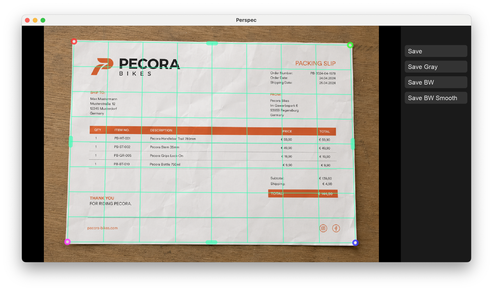
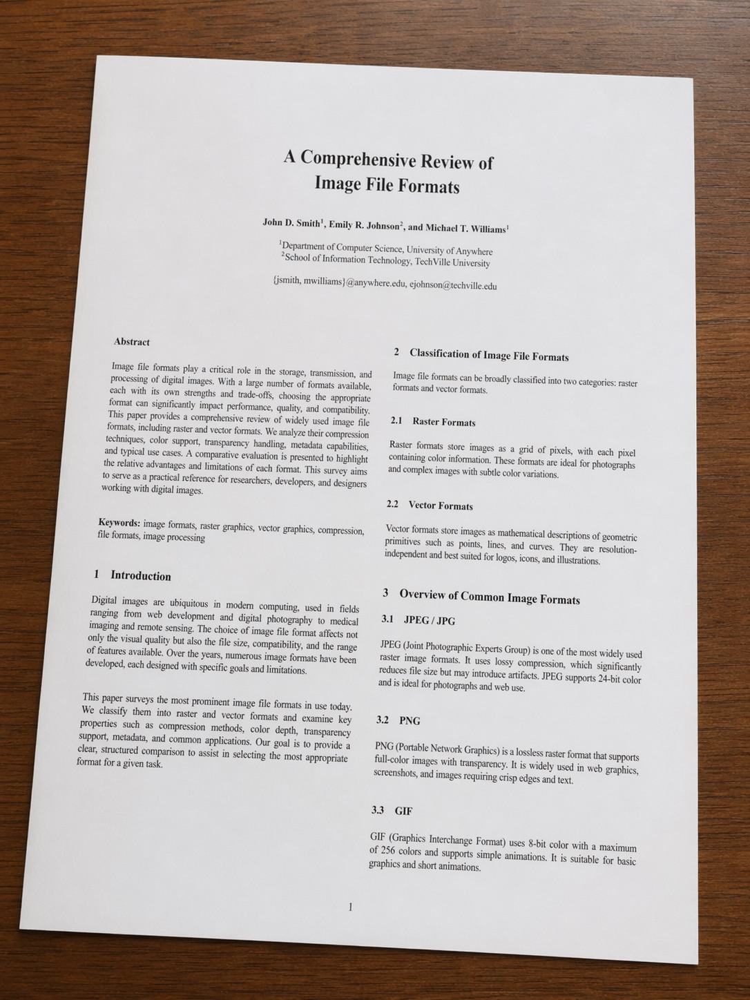
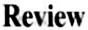
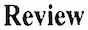
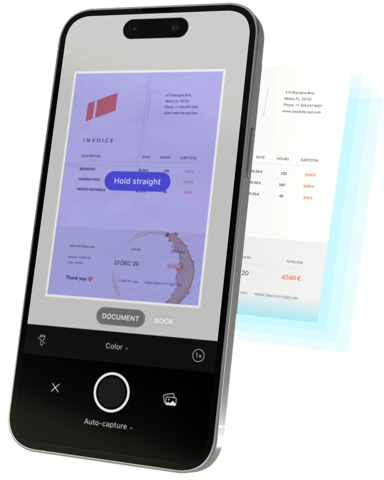
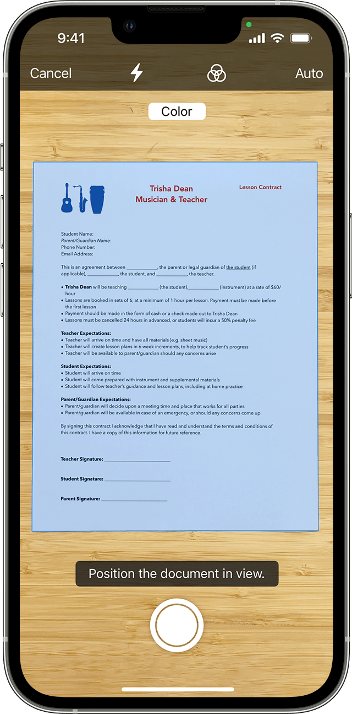
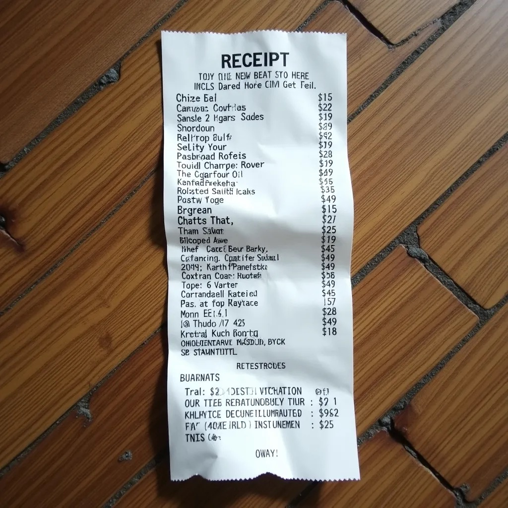
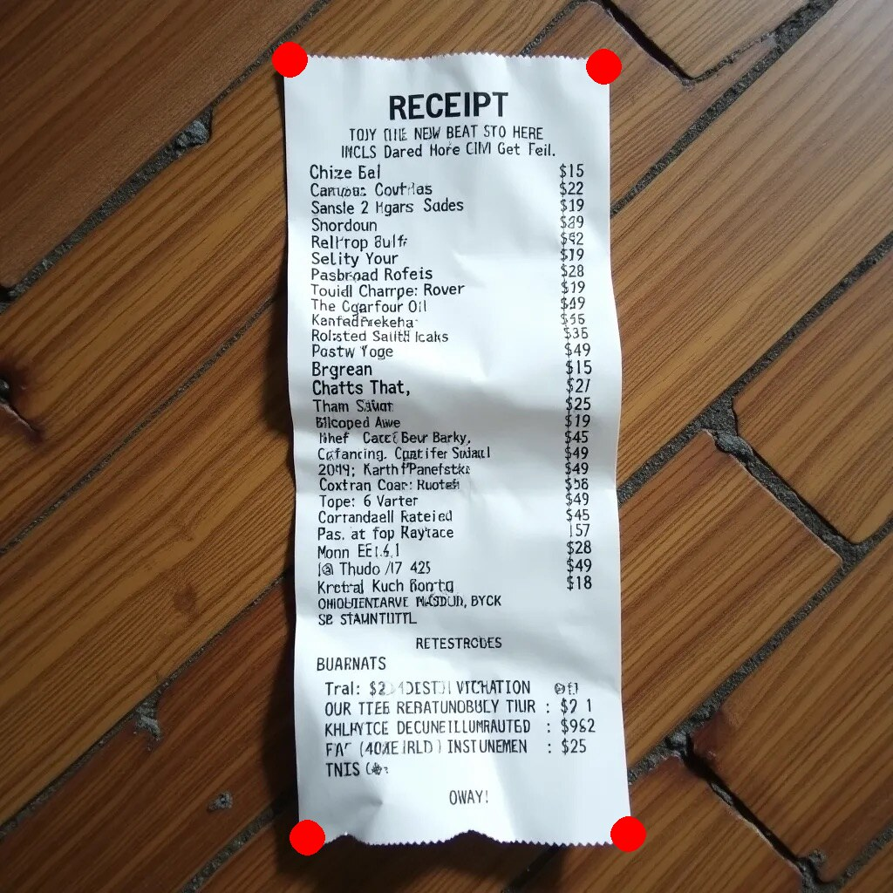
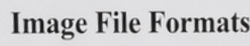
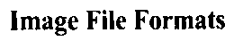

I'm very excited to announce the 1.0 release of [Perspec]!

Perspec is a desktop app to correct the perspective of images.
This is primarily useful for photos of documents and receipts,
but it can be used for any kind of image.



This has finally become the app I envisioned
when I started working on the project 9 years ago.
I didn't think it would take me this long to get here,
but I'm very happy with the result and I hope you'll like it too!


## Initial Motivation

You're probably familiar with the scanner apps available for mobile phones, like
[Adobe Scan](https://www.adobe.com/acrobat/mobile/scanner-app.html), [vFlat](https://www.vflat.com),
[SwiftScan](https://swiftscan.app/), … and numerous others.
Scanning functionality is also integrated into
[Dropbox](https://www.dropbox.com/features/productivity/document-scanner),
and these days even natively into [iOS](https://support.apple.com/en-us/108963) itself.

However, I don't like working on my phone and I'd rather just take photos of the documents and receipts
and deal with cleaning them up and organizing them on my computer another day.
There, I have a big screen, a keyboard, and a precise mouse,
which makes editing faster and more accurate.

Also, the mobile apps make some annoying technical decisions
in the name of giving users something they're familiar with.

For example:
If you store a document as a grayscale PNG,
you can get small file sizes without introducing any compression artifacts.
However, all common apps will give you a grayscale JPEG image
with much bigger file sizes and worse image quality,
just because JPEG is what people are familiar with.

Or maybe I'm giving them too much credit
and they actually don't know that PNGs can
be smaller than JPEGs if the image contains large areas of uniform color,
whereas for normal photos, JPEGs are smaller than PNGs.
And no, converting it to PNG afterwards is not an option,
as by then the image already contains all the JPEG compression artifacts.

For example, let's compare the results of scanning the following document:



The other apps produce bigger files, and you can clearly see
the compression artifacts that degrade the result.

<table>
  <thead>
    <tr>
      <th>App</th>
      <th>Result</th>
      <th>Preview</th>
      <th>Notes</th>
    </tr>
  </thead>
  <tbody>
    <tr>
      <td>Perspec</td>
      <td>
        ~110 kB, PNG
        <br>
        <a href="result_perspec.png" target="_blank">View result</a>
      </td>
      <td>
        
      </td>
      <td></td>
    </tr>
    <tr>
      <td>Scanner Pro</td>
      <td>
        ~190 kB, JPEG
        <br>
        <a href="result_scanner_pro.jpeg" target="_blank">View result</a>
      </td>
      <td>
        
      </td>
      <td>Extracted JPEG from exported PDF</td>
    </tr>
    <tr>
      <td>iOS</td>
      <td>
        ~300 kB, JPEG
        <br>
        <a href="result_ios.jpeg" target="_blank">View result</a>
      </td>
      <td>
        
      </td>
      <td>Extracted JPEG from exported PDF</td>
    </tr>
  </tbody>
</table>

Another thing that annoys me more than it should is the
ridiculous detection previews that seemingly every app includes these days:

<table>
  <tr>
    <td></td>
    <td></td>
  </tr>
</table>

While you're taking a photo, the app shows you a live overlay
of where it detects the document.
This, however, doesn't help you at all.
Just because it can detect the document correctly in the preview video feed
doesn't mean it will detect it correctly in the final photo.
Due to the higher resolution, different lighting (exposure times, flash, …),
and different contrast,
the detection will often be quite different in the final photo.

So all the preview is telling you
is that there is indeed a document in front of your camera,
which you already know since you placed it there. 🤦‍♂️

Lastly, and most importantly, I knew I could build
a better document detection algorithm for the kind of photos I was taking.
The detection in existing apps would often be slightly off,
even if you had a good picture
with good contrast between the document and the background.

Most apps use some kind of edge detection step in their pipeline,
as Dropbox [explains here](https://dropbox.tech/machine-learning/fast-and-accurate-document-detection-for-scanning).
But I knew that documents and receipts often don't have straight edges
but rather wrinkled or curved ones.
When you try to match even just a slight curve with a straight line,
the endpoints will be quite far off.
So instead, it should try to detect the corners and build up the document from there.
There is a detailed comparison of the computer vision techniques later in the post.


## The Long Road to 1.0

I was still a student when I started to work on Perspec
and had to scan a lot of stuff for my studies,
so I had plenty of motivation to build something like this.

Sure, you could also fix the perspective with Photoshop, [Affinity Photo], or [GIMP].
But the overhead is substantial:
Open each photo, find the perspective tool, drag the corners,
pick the right export settings, repeat for the next photo, …
These tools are built to do everything with any image
and not to churn through 50 receipts as quickly as possible.
I wanted an app that's focused on this one task,
with a workflow that's as streamlined as possible.

My first iteration was a fully automatic CLI app called [Perspectra],
implemented with Python and [scikit-image].
You'd pass your image and it would try to detect and extract the document for you.
Simple as that.

Although I actually liked [scikit-image] --
feature-rich, yet more straightforward than [OpenCV] --
I quickly realized that I absolutely do not like Python.
But more importantly, I realized that I also needed a GUI
to fix incorrectly detected document boundaries,
as the fully automatic CV pipeline would never get all documents 100% right.

And how do you build a desktop app with a GUI?
Obviously with Haskell. 😝
Joking aside, I had recently started learning Haskell and was absolutely in love with it.
So naturally, I wanted to see if it could be used for building the desktop app.

As I didn't want to use Python any longer,
my next instinct was to use ImageMagick for the computer vision and image manipulation tasks,
as I had some experience with its features and capabilities.
The [existing Haskell bindings](https://hackage.haskell.org/packages/search?terms=magick)
were rather lacking, so I opted to simply call `magick` as an external process.
While this mostly worked, it was always a pain to get it installed
and linked correctly across platforms,
and the performance was surprisingly bad for larger images.

Another obvious choice might be OpenCV, but I had some bad memories of using it at university
(maybe it was just the C++ context …), and the Haskell bindings looked rather painful.

So, my next experiment was using [Hip](https://github.com/lehins/hip).
With the help of the author [@lehins](https://github.com/lehins) himself
and [@HanStolpo](https://github.com/hanstolpo),
we were able to make it work at ZuriHac! _(Thanks again!)_

However, it was still missing some features that I wanted, like binarization with Otsu's Method.
While it was certainly possible to implement this in Hip,
I (for once) felt that Haskell's abstractions didn't really help with the task at hand
and only complicated things unnecessarily.
A `for` loop in C, by comparison, is conceptually very simple and just as fast as the Haskell code.
Luckily, C is a first-class citizen in Haskell
and it's very easy to bundle some C code and call it via Haskell's FFI.

Unfortunately, there didn't seem to be a straightforward C library
that I could hook up to Perspec without too many FFI headaches,
and so I started to work on [FlatCV] —
a pure C library for computer vision and image manipulation.

I might have overdone it with the yak shaving here,
but since the whole project is a labor of love anyway,
why not go all the way? 😅

I'm quite happy with the experience of using C for the image manipulation algorithms,
and I was able to quickly build a fully functioning version with the necessary Haskell bindings.
Just recently, I released [version 0.3.0](https://github.com/ad-si/FlatCV/releases/tag/v0.3.0),
and by now it has most of the basic operations you would expect from an image manipulation library.
I also ported some of the higher-level CV operations,
like [adaptive binarization](https://flatcv.ad-si.com/binarize.html#smart-black--white)
and [corner detection](https://flatcv.ad-si.com/corner-detection.html),
that I first implemented in [Perspectra].

There are still plenty of opportunities to improve the performance of FlatCV:
SIMD, GPU usage,
[streamed processing](https://github.com/libvips/libvips/wiki/Why-is-libvips-quick), etc.
However, as FlatCV isn't used in a real-time context (i.e., 60 fps),
the performance is already more than sufficient.

Hope you like it, and I'd be interested to know
if you have any other use cases for FlatCV!

With FlatCV in place, I could finally implement the last missing piece for 1.0:
automatic corner detection directly in Perspec.


## Edge Detection vs. Corner Detection

As promised, let's take a closer look at the computer vision techniques
for detecting documents in photos.

Most scanner apps detect documents with a pipeline
along the lines of the one
[described by Dropbox](https://dropbox.tech/machine-learning/fast-and-accurate-document-detection-for-scanning):

1. Downscale the image
1. Run an edge detection algorithm (e.g. [Canny])
1. Find the most prominent straight lines with a [Hough transform]
1. Build quadrilaterals from the intersections of those lines
    and score them to pick the best one

This works great for a perfectly flat sheet of paper on a high-contrast background.
But real documents are rarely perfectly flat.
Receipts are wrinkled, book pages are curved,
and paper that has been folded never lies completely flat either.
When you fit a straight line to a curved edge,
the intersections of the lines (i.e. the reconstructed corners)
can be quite off, even if the edge detection itself was perfect.

Perspec therefore approaches it from the other side:
Instead of looking for straight edges,
it segments the photo into document and background
and then derives the corners from the document's outline.
This is FlatCV's [corner detection](https://flatcv.ad-si.com/corner-detection.html)
pipeline in detail:

1. Convert the image to grayscale and downscale it to 256×256 px.
    (The detection doesn't need the full resolution, and this makes it fast.)
1. Blur the image to get rid of noise and paper texture.
1. Create an elevation map with a [Sobel filter].
    (Strong edges become mountain ridges.)
1. Flood the elevation map with [watershed segmentation]:
    The center of the image seeds the document basin
    and the image border seeds the background basin.
    The result is a binary mask of the document.
1. Smooth the mask with a binary closing.
1. Run a [Förstner corner detector] on the mask.
    (Unlike the more popular Harris detector,
    whose corners are shifted inwards,
    the Förstner detector yields sub-pixel accurate corner positions.)
1. Sort the corner candidates and
    keep the 4 corners with the largest angles.
1. Scale the corner coordinates back up to the original resolution.

<table>
  <thead>
    <tr>
      <th>Input</th>
      <th>Detected Corners</th>
    </tr>
  </thead>
  <tbody>
    <tr>
      <td></td>
      <td></td>
    </tr>
  </tbody>
</table>

The nice thing about this approach is that it never assumes straight edges.
The watershed happily follows a wrinkled document boundary,
and even on a crumpled receipt the corners are still locally well defined.

And if the detection does get it wrong,
you can simply drag the selection polygon into the right size and position.
The best of both worlds: automatic detection and manual correction.


## Binarization Algorithms

Correcting the perspective is only half the story.
For documents and receipts, the other half is converting the photo
into a clean black & white image.
This is what the `Save BW` and `Save BW Smooth` buttons in Perspec do.

The task sounds trivial:
Every pixel darker than some threshold becomes black
and every other pixel becomes white.
The tricky part is picking the threshold.

The classic solution is [Otsu's Method]:
It builds a histogram of all gray values in the image
and then picks the threshold that best separates
the dark pixels (the text) from the bright pixels (the paper).
This works well … for evenly lit images.

Unfortunately, photos are seldom evenly lit.
There is often a brightness gradient or a shadow —
often cast by the very hand that's holding the camera.

The document scanning literature is full of locally adaptive algorithms
(e.g. [Niblack and Sauvola]) that compute an individual threshold
for every pixel based on its neighborhood.

FlatCV's [smart black & white conversion](https://flatcv.ad-si.com/binarize.html),
however, uses a simpler trick to get away with a single global threshold:
It removes the shadows *before* thresholding.

1. Convert the image to grayscale.
1. Create a heavily blurred copy of it
    (with a blur radius of roughly 10% of the image size).
    All the text and details get averaged away
    and what remains is basically just the illumination:
    brightness gradients and soft shadows.
1. Subtract the blurred copy from the grayscale image.
    This keeps the high frequencies (the text)
    and removes the low frequencies (the shadows).
    The result is an evenly lit image.
1. Apply a global threshold calculated with Otsu's Method.

For photos of printed documents,
I've found this to work just as well as or even better than
the more complicated locally adaptive algorithms,
while being faster and simpler to implement.

The `Save BW` button applies exactly this pipeline
and stores the result as a true 1-bit black & white image,
where every pixel is either fully black or fully white.

The new `Save BW Smooth` button goes one step further and uses
two thresholds (the Otsu threshold ± a small offset):
Pixels below the lower threshold become black,
pixels above the upper threshold become white,
and pixels in between keep a scaled gray value.
This yields anti-aliased edges, so the text doesn't look jagged,
while the file size stays almost as small.
That's why it's the recommended option
for documents, receipts, and whiteboards.

<table class="bordered">
  <tbody>
    <tr>
      <th scope="row">Input</th>
      <td></td>
    </tr>
    <tr>
      <th scope="row">Save BW</th>
      <td></td>
    </tr>
    <tr>
      <th scope="row">Save BW Smooth</th>
      <td></td>
    </tr>
  </tbody>
</table>


## What Else Is New in 1.0

The automatic corner detection is the headline feature,
but quite a few other things landed in
[the 1.0 release](https://github.com/ad-si/Perspec/releases/tag/v1.0.0.0):

- Support for Windows.
    With macOS and Linux already covered,
    Perspec now runs on all 3 major desktop operating systems.
- The edges of the selection polygon can now be dragged as well
    (previously only the corners),
    and grid lines make it easier to align the selection.
- A new "Select Files" view with a button
    and drag-and-drop support for selecting images.
- The new `Save BW Smooth` export option that converts the image
    to anti-aliased black & white.
    This is now the recommended option for documents, receipts, and whiteboards.
- EXIF rotation data is now also handled for PNGs.
- An upgrade to the latest version of [Brillo],
    which brings an improved app design, button hover effects,
    and per-OS default fonts.

Check out the [changelog](https://github.com/ad-si/Perspec/blob/master/changelog.md)
for the full list of changes.


## Installation

You can buy Perspec on
[itch.io](https://feramhq.itch.io/perspec) or
[Gumroad](https://feram.gumroad.com/l/perspec).
This gets you a license key,
which removes the annoying "please buy a license" messages in the app.

Prebuilt binaries for macOS, Windows, and Linux are also available on the
[releases page](https://github.com/ad-si/Perspec/releases),
and on macOS you can install it via my [Homebrew](https://brew.sh) tap:

```sh
brew install --cask ad-si/tap/perspec
```

However, you'll still need to buy a license
to get rid of the banner in those versions as well.

And even if you don't need the software yourself,
please consider buying it as a way to support the development of
Haskell desktop applications and computer vision software.

Afterwards, you can either drop images onto the app window
or batch process them via the CLI:

```sh
perspec fix photos/*.jpeg
```


## Next Steps

While the 1.0 release is a big milestone, there are still some features
that I would like to add in the future.
Here is what I have planned for the upcoming releases:

- **Fixed output sizes:**
    Force the output to standardized dimensions like A4 or US Letter,
    so a scanned document ends up with the correct proportions and size.
- **QR code detection:**
    Marcel Robitaille wrote a great post about
    [automating receipt ingestion](https://blog.marcelrobitaille.me/receipt-ingestion/)
    where a QR code next to the document is used to attach metadata.
    I'd love to support such workflows out of the box.

If this sounds useful to you, [give Perspec a try][Perspec]!
And if you run into any issues or have ideas for improvements,
please [open an issue](https://github.com/ad-si/Perspec/issues) —
I'd love to hear your feedback!

---

[Affinity Photo]: https://www.affinity.studio/photo-editing-software
[Brillo]: https://github.com/ad-si/Brillo
[Canny]: https://en.wikipedia.org/wiki/Canny_edge_detector
[FlatCV]: https://github.com/ad-si/FlatCV
[Förstner corner detector]: https://en.wikipedia.org/wiki/Corner_detection#The_F%C3%B6rstner_corner_detector
[GIMP]: https://www.gimp.org/
[Hough transform]: https://en.wikipedia.org/wiki/Hough_transform
[Niblack and Sauvola]: https://scikit-image.org/docs/stable/auto_examples/segmentation/plot_niblack_sauvola.html
[OpenCV]: https://opencv.org
[Otsu's Method]: https://en.wikipedia.org/wiki/Otsu%27s_method
[Perspec]: https://github.com/ad-si/Perspec
[Perspectra]: https://github.com/ad-si/Perspectra
[scikit-image]: https://scikit-image.org/
[Sobel filter]: https://en.wikipedia.org/wiki/Sobel_operator
[watershed segmentation]: https://en.wikipedia.org/wiki/Watershed_(image_processing)
