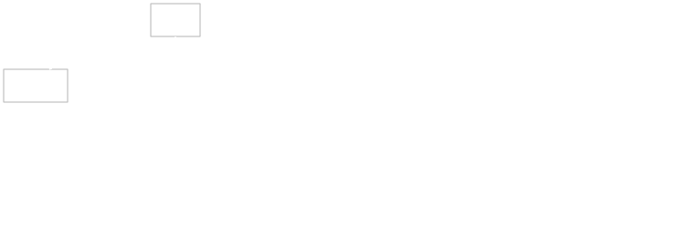

For this post I'm going to try a new hybrid slides + text format.
I attached an explanation at the bottom on how to build it


# Why instead of JavaScript

- Safety
  - No more undefined is not a function
  - No more `0 === false`
- Maintainability
- No more mutation
    ```js
    for (var key in object) {
      elements[key] = () => key.toUpperCase()
    }
    ```

## Expanding Brain Meme

ES3 -> ES2015 -> TypeScript -> PureScript


## Basics

- TODO: History
- Prelude
  - Must be included explicitly
  - Smaller
  - No libraries are distributed with the compiler
- Strict, and not Lazy
- head, tail, … save per default
- More explicit (X has unspecified imports, consider using the explicit form)
- Arrays instead of Lists
  - `(:)` exists only for Arrays. `Cons` for Lists
- No tuples
- No qualified keyword as everything is imported qualified
- Type classes in modules must be specifically imported `import A (class B)`

- Type variables must be declared `length :: forall a. Array a -> Int`
- No Template PureScript (yet)
- Instance chains
- Applicative Do
- `class (Eq a) <= Ord a where …` Interpret it as logical implication
- Instances must be given names
  `instance arbitraryUnit :: Arbitrary Unit where …`
  (Only used for code generation)
- Orphan instances are completely disallowed
- In documentation `|` must appear on every line


### Deriving

`StandaloneDeriving`

```haskell
data Point = Point Int Int deriving (Eq, Ord)
```

becomes

```purescript
data Point = Point Int Int

derive instance eqPoint :: Eq Foo
derive instance ordPoint :: Ord Foo
```

### Defining Operators

Only available as operator alias for a named function.

```haskell
f $ x = f x
```

becomes

```purescript
apply f x = f x
infixr 0 apply as $
```

### Operator Sections

Operator sections are only available with wildcards:

```purescript
(2 ^ _)
(_ ^ 2)
```


### Names

Haskell        | PureScript
---------------|-----------
`IO`           | `Effect`
`data () = ()` | `data Unit = unit`
`&`            | `#`
`Bool`         | `Boolean`
`..`           | `range`
`++`           | `<>`
`fmap`         | `map`
`Text`         | `String`
`.`            | `<<<`
`>>>`          | `>>>`
`[a]`          | `Array a` / `List a`
`(a,b)`        | `Tuple a b`
`return`       | `pure`
`[x | x*2]`    | `guard` monad
`undefined`    | `unsafeCoerce`
`>>`           | `*>`

But as nothing is included per default you can change everything


## Low level adaptions to JavaScript

```
Boolean = true | false
```

Arrays instead of lists


## Additional Features

### Records

```purescript
module Main where
import Effect.Console (log)

book =
  { title: "Eine Woche voller Samstage"
  , author: "Paul Maar"
  , year: 1973
  }

main = log book.title
```

compiles to

```javascript
// Generated by purs version 0.12.0
"use strict";
var Effect_Console = require("../Effect.Console/index.js");
var book = {
    title: "Eine Woche voller Samstage",
    author: "Paul Maar",
    year: 1973
};
var main = Effect_Console.log(book.title);
module.exports = {
    book: book,
    main: main
};

```


Sidenode: That's also a reason why `.` isn't used for function composition


### Records are Row Types

```haskell
data Book = Book { title :: Text, author :: Text, year :: Int }
```

```purescript
type Book = { title :: Text, author :: Text, year :: Int }
```


Update a record:

```
nextBook = book {title = "Am Samstag kam das Sams zurück"}
```

Sidenode: This would be ambigious
if Records used `=` instead of `:` for assignments.

Apply function `book` to object `{ title: "…" }`
or update the `title` of `book`?


# Row Polymorphism

```purescript
log $ _.title book
log $ _.title {title: "Just a title"}
```


# Pattern matching on records

```purescript
paulsTitle {author = "Paul Maar", title = t} = Just t
paulsTitle _ = Nothing
```


### Row Types

ROW TYPES *blink* *blink*

multiline strings


### Type Class Hierarchy


From: https://pursuit.purescript.org/packages/purescript-control/4.1.0




From: https://wiki.haskell.org/Typeclassopedia

Comparison: http://techscursion.com/2017/02/typeclass-cheatsheet.html


### Active Extensions

- DataKinds
- EmptyDataDecls
- ExplicitForAll
- FlexibleContexts
- FlexibleInstances
- FunctionalDependencies
- KindSignatures
- MultiParamTypeClasses
- PartialTypeSignatures
- RankNTypes
- RebindableSyntax
- ScopedTypeVariables


### Tooling

ghc -> purs
ghci -> purs repl
ghcid -> pscid
stack -> pulp
stack init -> pulp init
stack exec -> pulp run
haskell.org -> purescript.org
hackage.haskell.org -> bower (or psc-package via git)
hoogle.haskell.org -> pursuit.purescript.org
try.haskell.org -> try.purescript.org (not up to date)


Haskell is catching up with recent releases of GHC
as most PureScript developers are also Haskell developers


### TODO: Output of currying

### TODO: Foreign Function Interface

### TODO: Use Cases

- Reactive Tools / Websites
- JavaScript Plugins
- Serverless
- CLI tools which also run in the Browser
- Frontend
- Game Development (https://bodil.lol/purescript-is-magic/)
- Scripting interface for JavaScript libraries


### TODO: Notable Projects

- Insect
- Transity (shameless plug)
- Halogen (UI library)
- Pux (Web apps like Elm)
- Flare (Reactive UI)  // TODO: https://www.youtube.com/watch?v=iTSosG7vUyI&t=16s
- Neodoc (CLI args parser)
- [Neon] - alternative Prelude
- All kinds of bindings / wrapper (D3, React, …)
- [PureScript Pop] - FRP demo

[PureScript Pop]: https://github.com/lettier/purescript-pop
[Neon]: https://github.com/tfausak/purescript-neon


## The Not so Good

- Trying to remember the differences to Haskell
- New versions break a lot
- Performance
- Memory footprint of Node.js
- Smaller Ecosystem


## Getting Started

[javascript-to-purescript]

[javascript-to-purescript]: https://github.com/adkelley/javascript-to-purescript


## PureScript of Elm


## Future

- Backends
  - pure-c - C backend for PureScript
  - pureswift - Swift backend for PureScript
- Haskell
  - Compiles to Webassembly?
  - Fixes Records?


## Summary

Best way to write JavaScript at the moment


## TODO

- https://youtu.be/5AtyWgQ3vv0 - PureScript: Tomorrow’s JavaScript Today
